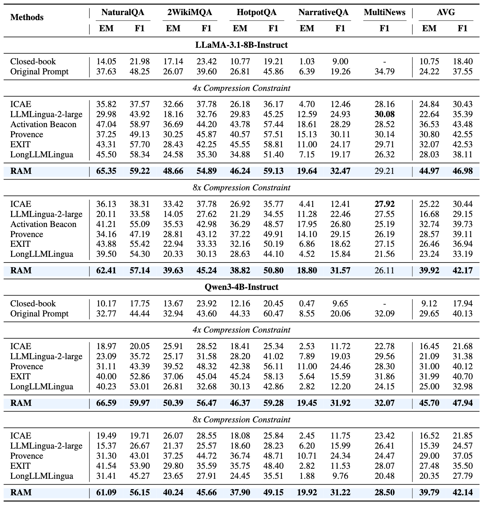

<div align="center">

<h2>Read As Human: Compressing Context via Parallelizable Close Reading and Skimming</h2>

</div>

<div align="center">
  <a href='https://arxiv.org/abs/2602.01840'></a>
  <a href='https://huggingface.co/Twwilght/RAM-Qwen3-4B'></a>
  <a href='https://huggingface.co/datasets/Twwilght/RAM-NQ'></a>
</div>

This is the official repository for our paper "Read As Human: Compressing Context via Parallelizable Close Reading and Skimming". Our work introduces RAM (Read As HuMan), a novel context compression framework that mimics human reading behavior (*close reading* on query-relevant segments while *skimming* less relevant content) to achieve both computational efficiency and natural language interpretability in long-context LLM inference.

<div align="center">
  
</div>

# Overview
Large language models (LLMs) face significant challenges in long-context scenarios: quadratic computational complexity from self-attention and inherent information redundancy in natural language. Existing task-aware compression methods either process full sequences at once or rely on autoregressive compression, suffering from inefficiency, while also facing a trade-off between key information retention and natural language interpretability.

We propose:
- **Adaptive Hybrid Reading Strategy**: Parallel encoding of context segments with the query, followed by relevance-based adaptive compression—fully retaining high-relevance segments (*close reading*) and compressing low-relevance ones into compact summary vectors (*skimming*)
- **Hybrid Representation**: Concatenating explicit textual segments with implicit summary vectors to preserve key information while maintaining natural language format interpretability
- **Contrastive Learning Objective**: Optimizing the decision boundary between close reading and skimming using annotated positive/negative query-segment pairs

## Release
- [02/12] Initial Release. Inference-stage code is now available!

## Main Results
RAM demonstrate superiority performance across QA and summarization.
<div align="center">
  
</div>

## Case Study
<div align="center">
  
</div>

## Inference
### Data Preparation
1. Input data should be formatted as a `.jsonl` file, where each line follows the schema: `{"prompt": str, "answer": List[str], "input": str}`. Here, `prompt` represents the input question, `answer` is a list of ground-truth answers, and `input` contains the long context.
2. Configure paths in `data.py` by setting `path` to your input file location and `out_path` to your desired output location. A preprocessed NaturalQuestions test set is available at [RAM-NQ](https://huggingface.co/datasets/Twwilght/RAM-NQ).

### Execution
1. Modify paths in `qa.sh` to match your environment:
   - `data_path`: Path to preprocessed dataset
   - `checkpoint_path`: Path to trained RAM weights
   - `base_model`: Encoder model path
   - `target_model`: Decoder model path
   - `output_dir`: Directory for saving inference results
2. Download pretrained weights from [RAM-Qwen3-4B](https://huggingface.co/Twwilght/RAM-Qwen3-4B).
3. Run inference with: `bash qa.sh`

## BibTeX
If you find our repo helpful, please consider leaving a star and cite our paper :)

```bibtex
@article{tang2026read,
  title={Read As Human: Compressing Context via Parallelizable Close Reading and Skimming},
  author={Tang, Jiwei and Liu, Shilei and Zhang, Zhicheng and Lv, Qingsong and Zhao, Runsong and Lu, Tingwei and Liu, Langming and Chen, Haibin and Yuan, Yujin and Zheng, Hai-Tao and others},
  journal={arXiv preprint arXiv:2602.01840},
  year={2026}
}
```